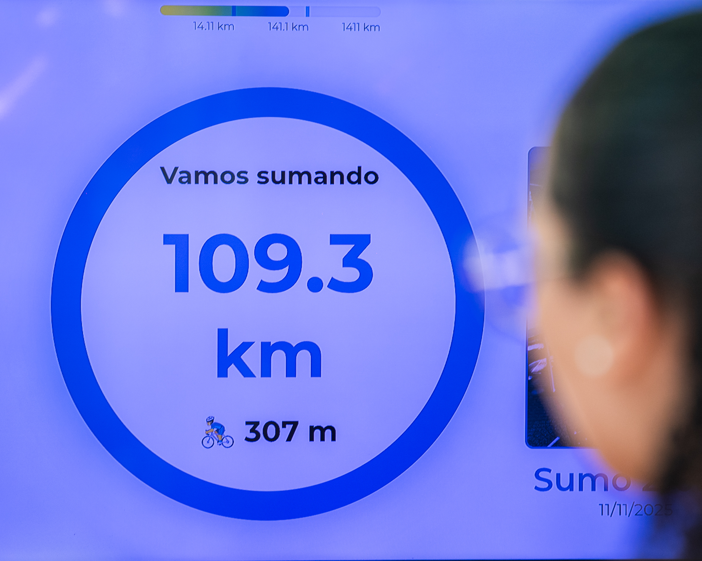
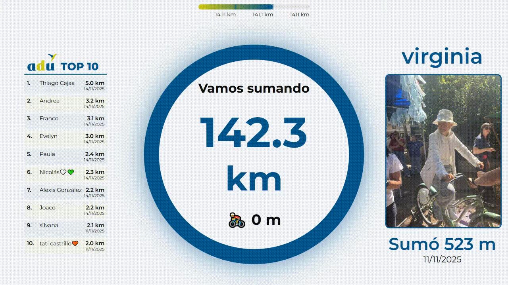

# DMDBike: promoviendo actividad física mediante un objetivo comunitario

¿Cómo promover la actividad física en un evento masivo? ¿Es posible hacerlo si se dispone de poco espacio y un tiempo limitado por cada participante? ¿Cómo hacer que sea divertido y desafiante?

Estas son algunas de las preguntas disparadoras que incentivaron esta propuesta.

Este proyecto registra la distancia recorrida en una bicicleta común utilizando un rodillo de ciclismo, un **sensor Hall** y un **imán** en la rueda. Una **Raspberry Pi 4** procesa los datos del sensor, mantiene un registro confiable de los kilómetros y muestra la información en tiempo real en una pantalla/TV.



## 🎯 Caso de uso

El proyecto se utilizó en actividades del **Día Mundial de la Diabetes 2025**, a cargo del grupo de líderes de la **Asociación de Diabéticos del Uruguay (ADU)**. 
- El 11/11/2025 en la Plaza Libertad (Plaza Cagancha). Evento organizado por ADU. Donde 88 personas pedaleron en la bicleta.
- El 14/11/2025 en la *Feria saludable interactiva* organizada por la Policlínica de Diabetes del Hospital Maciel, donde pedalearon 78 personas.

Su propósito es fomentar la actividad física y la participación comunitaria, permitiendo que cualquier persona suba a la bicicleta, pedalee unos minutos y vea inmediatamente:

- La distancia que esta recorriendo.
- La distancia acumulada por todos los participantes.
- El nombre, foto y distancia que aportan los distintos participantes.
- Un ranking con el nombre de los participantes que aportaron mayor distancia.
- Un conjunto de metas definidas con una barra de progreso.



El sistema está pensado para eventos masivos, ferias de salud, actividades escolares, jornadas deportivas y contextos donde se busque **visibilizar el movimiento y generar motivación colectiva**.

## 🚧 Arquitectura general

### Hardware
- Bicicleta común sobre rodillo de ciclismo.
- Imán potente (por ejemplo, extraído de un disco duro).
- Sensor Hall A3144 apuntando al imán.
- Raspberry Pi 4 con Raspberry Pi OS.
- TV/monitor (Full HD) conectado por HDMI donde se muestra el panel principal.

### Software
- Python 3 + Flask como servidor web.
- SQLite (`bici.db`) como base de datos sencilla y eficiente para el caso de uso.
- `sensor.py`: script que escucha el sensor Hall y acumula distancia en la db.
- HTML/CSS/JS para el panel principal y vistas de administración.
- Servicios `systemd` para garantizar arranque automático y reinicio ante fallos.
- Hotspot Wi-Fi propio para operar el sistema sin infraestructura externa.

## 📟 Funcionamiento del sensor (sensor.py)

El archivo `sensor.py` detecta cada pulso del sensor Hall (flanco descendente) y calcula distancia recorrida según:

- `WHEEL_CIRCUMFERENCE_M`: circunferencia real de la rueda en metros.
- `MAGNETS_PER_WHEEL`: número de imanes colocados (con 1 es suficiente para el caso de uso).
- Los kilómetros se actualizan en la tabla `estado` de `bici.db`.


## 🔗 Endpoints principales (app.py) 
- (/) Muestra la pantalla principal. En el centro se ve el círculo del Día Mundial de la Diabetes junto con los kilometros totales acumulados, la distancia recorrida en la sesión actual con actualizaciones en tiempo real. A la izquierda se visualiza el top de sesiones con nombre, distancia y fecha. En la derecha se encuentra una galería donde se muestran al azar los distintos participantes con su nombre, foto y distancia.
- (/pictures) Permite guardar la sesión actual con nombre y foto del participante. Se debe guardar cuando el participante finalice ya que la distancia es almacenada automaticamente y la sesion actual es reiniciada al finalizar. Además se puede reiniciar la sesion de pedaleo (esta se reinicia automatiacamente cada 30').
- (/carga_manual) Esta ruta permite guardar una sesión ingresando los km manualmente, la distancia aqui ingresada cuenta para el Top pero no se suma a la distancia total desplegada en la pantalla principal. Esto debe utilizarse para casos puntuales donde se haya olvidado registrar al participante cuando correspondía.
- (/sync) Dado que la RaspberryPi no contará con conexión a internet, la fecha y hora estará desincronizada con la real. Al comenzar el evento, este endpoint permite sincronizar la fecha y hora con la del celular utilizado para operar los paneles de administración.

## 🧩 Estructura del proyecto
  
```
.
├── app.py                 # Servidor Flask principal
├── sensor.py              # Lector del sensor Hall
├── bici.db                # Base de datos SQLite (Se debe generar)
├── db_init.py             # Inicialización de DB
├── consultas.py           # Herramientas/consultas de mantenimiento
├── backup_bike.sh         # Script para generar backups
├── templates/
│   ├── index.html         # Pantalla principal (TV)
│   ├── pictures.html      # Carga de sesión automática
│   ├── manual.html        # Carga de sesión manual
│   └── sync.html          # Sincronizar fecha/hora desde el celular
└── static/
    ├── css/
    ├── js/
    ├── images/
    └── uploads/           # Fotos de participantes (.webp)
```

## 📺 Conexión y ejecución

En todo momento se asume que se esta utilizando una RaspberryPi 4 con sistema operativo Raspberry Pi OS.

Asegurar las siguientes dependencias (normalmente ya vienen instaladas):

- Flask
- Pillow
- RPi.GPIO
- dotenv

### Variables de entorno
```env
FLASK_SECRET_KEY="Cambiar por clave"
DB_PATH="Path de db, por defecto bici.db"
UPLOAD_FOLDER=static/uploads
MAX_MINUTOS_SESION=30
```

### Conexión de sensor

Para este proyecto se utilizó un sensor Hall A3144, que es un dispositivo de colector abierto. Esto significa que su salida **no genera voltaje por sí misma**, sino que necesita una resistencia pull-up para obtener un nivel lógico.

Se utilizó el GPIO 3 de la Raspberry Pi (BCM 3), que **tiene
una resistencia pull-up interna a 3.3 V**, por lo que NO se requiere una resistencia externa.

Conexión utilizada:

- **Vcc** → 5 V de la Raspberry Pi  
- **GND** → cualquier GND de la Raspberry Pi  
- **Salida (S)** → GPIO 3 (BCM 3)

⚠️ Es importante verificar el orden de los pines del sensor, ya que puede variar entre modelos o proveedores.

⚠️ Nunca conectar la salida del A3144 directamente a 5 V si va a un GPIO de la Raspberry Pi. Los pines GPIO solo toleran hasta **3.3 V**, un valor mayor podría dañar la placa. 

Antes de conectar, revisar siempre el datasheet o las marcas del encapsulado.

### Ejecución

Inicializar base de datos
```bash
python db_init.py
```

Activar la lectura del sensor
```bash
python sensor.py
```


Activar el servidor web accesible en http://IP_RASPBERRY:5000
```bash
python app.py
```

### Despliegue con systemd

Es recomendable configurar la raspberry para que inicialize app.py y sensor.py automaticamente, además de lanzar chromium en modo kiosk para la pantalla principal.

Revisar las rutas que se encuentran en estos snippets para que coincidan con las que correspondan.

```bash
sudo nano /etc/systemd/system/flaskapp.service
```

Servidor:
```ini
[Unit]
Description=Flask Bike App
After=network.target

[Service]
User=pi
WorkingDirectory=/home/pi/bike
ExecStart=/usr/bin/python3 /home/pi/bike/app.py
Restart=always

[Install]
WantedBy=multi-user.target
```

Sensor
```bash
sudo nano /etc/systemd/system/sensorhall.service
```
```ini
[Unit]
Description=Bike Hall Sensor
After=network.target

[Service]
User=pi
WorkingDirectory=/home/pi/bike
ExecStart=/usr/bin/python3 /home/pi/bike/sensor.py
Restart=always

[Install]
WantedBy=multi-user.target
```

Kiosk chromium

```bash
sudo nano /etc/systemd/system/kiosk.service
```

```ini
[Unit]
Description=Kiosk browser for bike project
After=graphical.target network.target
Wants=graphical.target

[Service]
User=pi
Group=pi
WorkingDirectory=/home/pi
Environment=DISPLAY=:0
Environment=XAUTHORITY=/home/pi/.Xauthority

# Abrir chromium en modo kiosko apuntando al flask
ExecStart=/usr/bin/chromium --kiosk --incognito http://localhost:5000

# Si el navegador se cierra, que vuelva
Restart=always
RestartSec=5

[Install]
WantedBy=graphical.target
```

Iniciar el *daemon*, esto hara que los scripts inicien apenas la raspberry encienda y además los reiniciará en caso de que algunno falle.

```bash
sudo systemctl daemon-reload
sudo systemctl enable sensorhall.service flaskapp.service kiosk.service
sudo systemctl start sensorhall.service flaskapp.service kiosk.service
```

## 📡 Raspberry como hotspot

Es fuertemente recomendable crear un punto de acceso Wi-Fi para operar desde el celular, ya que en eventos públicos el Wi-Fi puede ser inestable o inexistente.

## 💡 Algunas consideraciones

- El sistema deberiá arrancar solo, con el fin de ser operado sin necesidad de mouse o teclado.
- La hora debe sincronizarse al inicio del encendido, ya que sin conectarse a internet la raspberry tendrá la fecha y hora del úsltimo instante en el que estaba encendida.
- Las fotos se comprimen en WEBP para optimizar el tamaño, aun así, es recomendable utilizar una micro sd con tamaño suficiente para evitar inconvenientes. Para este proyecto se utilizó una micro sd de 128 Gb.
- La sesión activa se reinicia automaticamente cada 30 minutos, para evitar datos incorrectos en caso de que nadie haya guardado la sesión.
- Es recomendable que, cada vez que se sube un participante se reinicie la sesión, para evitar que ésta se reinicie automaticamente mientras el participante está pedaleando.

## 💾 Backups

El script `backup_bike.sh` genera archivos `.tar.gz` con:

- base de datos.
- fotos de los participantes.

De esta manera es posible recuperar la información de las sesiones. 

Es recomendable luego de cada evento realizar un backup y almacenarlo en un sitio externo a la Raspberry.

## Créditos

Proyecto desarrollado en el marco del Día Mundial de la Diabetes 2025.
Para el Grupo de Líderes de ADU (Asociación de Diabéticos del Uruguay).

Desarrollado por: Mauricio Simón

Las fotos del evento fueron tomadas por: [Joaquín Ormando](https://www.joaquinormando.com)

## Licencia

Este proyecto se distribuye bajo la licencia MIT. Puedes usarlo, modificarlo y compartirlo libremente, siempre manteniendo el crédito original.

MIT © 2025 Mauricio Simón Roglia

## Documentación adicional
- [Manual de operación](docs/MANUAL_DE_OPERACION.md)
